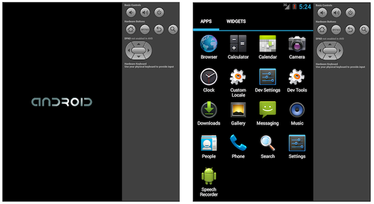
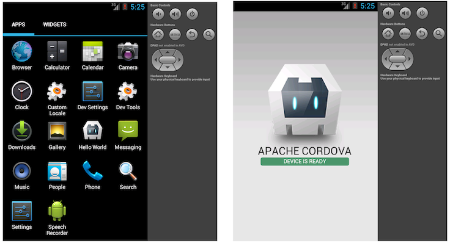

命令行界面（CLI）
====

本文介绍如何使用 命令行界面（CLI）创建应用程序，并将它们部署到各种原生移动平台。这个工具允许你创建新的项目，在不同的平台构建，并运行在实际设备或仿真器中。 CLI 是用于在[概述](../docs/overview.md)中描述的跨平台的工作流的主要工具。当然，你也可以使用 CLI 来初始化项目代码，然后切换到不同的平台的SDK和 shell 工具作为后续发展。

## 前提

使用 CLI 前，需安装目标平台的 SDK 。（详见[平台开发指南](../docs/platforms.md)）

CLI 支持平台情况：

* iOS (Mac)
* Amazon Fire OS (Mac, Linux, Windows)
* Android (Mac, Linux, Windows)
* BlackBerry 10 (Mac, Linux, Windows)
* Windows Phone 8 (Windows)
* Windows (Windows)
* Firefox OS (Mac, Linux, Windows)

**注：**对于只支持 Windows 的平台，可以在 Mac 机子上运行 Windows 的虚拟机，或者双启动形式运行 Windows。详见 [Windows Phone 8 平台指南](../docs/platforms-wp8.md) 和 [Windows 平台指南](../docs/platforms-win8.md) 

## 安装 Cordova CLI

安装 Cordova CLI 步骤如下：

1. 下载安装 [Node.js](http://nodejs.org/)
2. 下载安装 [git 客户端](http://git-scm.com/)。由于被墙，国内用户从官网下载困难，可异步至 [Git for Windows 国内下载站](https://github.com/waylau/git-for-win)
3. 使用 `npm` 安装 `cordova` 模块。国内用户可以通过设置镜像来加速安装，详见[加速 npm](http://www.waylau.com/faster-npm/)

对于 OS X 和 Linux:
    
```
$ sudo npm install -g cordova
```

对于 Windows:

```
C:\>npm install -g cordova
```

## 创建应用

切换到源代码的目录，然后运行命令，如下所示：

```
$ cordova create hello com.waylau.cordova.hello HelloWorld
```

这可能需要一些时间命令完成，请耐心等待。命令行 -d 选项会显示进度信息。

第一个参数 `hello` 指定你的项目要生成的一个目录。这个目录原来不存在，Cordova  会为您创建它。其子目录 `www` 容纳您的应用程序的主页，以及在`css`，`js`和`img`的各种资源，遵循共同的 Web 开发文件命名约定。这些资源将被存储在设备上的本地文件系统，而不是在远程服务上。该`config.xml`文件中包含有需要生成和分发应用程序的重要元数据。

第二个参数输入 `com.waylau.cordova.hello` 提供了一个项目的反向域名风格的标识。此参数是可选的，如果省略该参数，则必须省略第三个参数。您可以之后在`config.xml`文件编辑这个值，但建议您一开始就选择合适的值，因为 `config.xml` 生产代码会用到这个值，就像 Java 的包名一样。若不设置此值，则默认值是`io.cordova.hellocordova`。

第三个参数的 HelloWorld 提供了应用程序的显示标题。此参数是可选的。您可以之后在`config.xml`文件编辑这个值，但建议您一开始就选择合适的值，因为 `config.xml` 生产代码会用到这个值，就像 Java 的包名一样。若不设置此值，则默认值是`io.cordova.hellocordova`。默认值是 `HelloCordova` 。

## 添加平台

所有后续命令都需要在项目的目录下，或者在其范围内的任何子目录中运行：

```
$ cd hello
```

在您可以构建项目前，你需要指定一组目标平台。您运行这些命令的能力取决于你的机器是否支持每个 SDK，以及是否已经安装每个 SDK。在 Mac 运行：

```
$ cordova platform add ios
$ cordova platform add amazon-fireos
$ cordova platform add android
$ cordova platform add blackberry10
$ cordova platform add firefoxos
```

Windows 运行，其中 wp 是指不同版本的 Windows Phone 操作系统的：

```
$ cordova platform add wp8
$ cordova platform add windows
$ cordova platform add amazon-fireos
$ cordova platform add android
$ cordova platform add blackberry10
$ cordova platform add firefoxos
```

查看当前支持的平台：

```
$ cordova platforms ls
```

（注意 `platform` 和 `platforms` 的命令是同义的。）

运行下列命令的代名词，移除一个平台：

```
$ cordova platform remove blackberry10
$ cordova platform rm amazon-fireos
$ cordova platform rm android
```

（注意 `remove` 和 `rm` 的命令是同义的。）

运行命令添加或删除平台，会影响了项目的 `platforms`目录，该目录下为每个指定的平台显示其子目录的内容。 `www` 的源目录转载到每个平台的子目录中，例如`platforms/ios/www` 或 `platforms/android/assets/www`。由于 CLI 会不断地从源  `www` 复制文件，你应该只编辑这些源文件，而不是那些`platforms`下的子目录。如果您使用的版本控制软件，你应该把这个源  `www` 文件夹，随着`merges`文件夹一起添加到你的版本控制系统。 （关于`merges`文件夹的更多信息，可以在下面“使用 merges 自定义每个平台”中找到）

**警告：**当使用 CLI 来构建应用程序，你不应该在`/platforms/`目录编辑任何文件，除非你知道自己在做什么，或者说明文件另有说明。当应用程序构建或者插件准备重新安装时，该目录中的文件是经常会被覆盖的。

如果你意识到了这点，你可以使用一个 SDK，如用 Eclipse 或 Xcode 来打开你创建的项目。您将需要从`/platforms/`目录下打开资源来开发SDK。这是因为SDK特定的元数据文件存储在相应的`/platforms/`子目录中。 （请参阅[平台开发指南](../docs/platforms.md)了解如何在每个IDE中开发应用程序。）如果你只是想用 CLI 初始化一个项目，然后切换到 SDK 的原生工作，那么请使用此方法。

如果你想在整个开发周期使用跨平台的工作流方法（CLI），请继续往下阅读。

## 构建应用程序

默认的，`cordova create`脚本将会创建一个基于web 应用程序的骨架，主页是`www/index.html` 文件。

迭代的构建程序，运行

```
$ cordova build
```

可以制定构建的平台

```
$ cordova build ios
```

`cordova build`是下面命令的简化：

```
$ cordova prepare ios
$ cordova compile ios
```

在这种情况下，一旦运行了 `prepare`，你可以用苹果的 Xcode 的 SDK，以替代修改和编译 Cordova 生成的 `platforms/ios` 特定于平台的代码。您可以使用同样的做法在其他平台的 SDK 中。

## 在模拟器或者设备上测试应用

SDK 为移动平台往往捆绑模拟器来执行设备的图像，这样就可以从主屏幕启动应用程序，查看它是如何与众多平台功能进行交互的。运行如下命令，在特定平台构建应用，查看在模拟器中执行效果：

```
$ cordova emulate android
```

一些移动平台上在默认情况下会模拟一个特定的设备，比如 iOS 项目默认是 iPhone。对于其他平台，您可能需要首先将设备与模拟器相关联。

**注：**模拟器的支持目前不适用于 Amazon Fire OS。

（请参阅[平台开发指南](../docs/platforms.md)了解详细信息。）例如，您可以先运行 `android` 命令来启动Android SDK，然后运行特定设备的图像，而根据它的默认行为启动它：



接着用`cordova emulate`命令刷新模拟器图像显示最新的应用程序，现在是可以从主屏幕启动：



或者，你可以将手机插入电脑，并直接测试应用程序：

```
$ cordova run android
```

在执行上述命令前，先要在设备上做设置。在 Android 和 Amazon Fire OS 上, 需要先启用“USB debugging”选项。 请参阅[平台开发指南](../docs/platforms.md)了解各个平台的设置。

## 添加插件

插件，可以使应用获得与设备级别交流的能力，提供了原生组件的接口。你可以自己设计插件，如，设计一个混合了 Cordova WebView 和原生组件的 hybrid 应用（详见 * [嵌入 WebViews](../docs/webviews.md) 和 [插件开发指南](../docs/hybrid-plugins.md)）

3.0 版本后，创建一个 Cordova 是不会存在任何插件的，你需要按照需要显示的添加插件。

可以在 <http://plugins.cordova.io/> 查找插件，其中也包含第三方的插件。CLI 也能支持插件的查找。例如使用关键字`bar`、`code` 进行查找。

```
$ cordova plugin search bar code

com.phonegap.plugins.barcodescanner - Scans Barcodes
```

如果只是使用关键字`bar`，则查找结果为

```
cordova-plugin-statusbar - Cordova StatusBar Plugin
```

`cordova plugin add`命令是用来添加插件的，比如

* 基本设备信息(设备 API):

```
$ cordova plugin add cordova-plugin-device
```

* 网络连接和电池事件:

```
$ cordova plugin add cordova-plugin-network-information
$ cordova plugin add cordova-plugin-battery-status
```

* 加速度计，指南针，和地理位置:

```
$ cordova plugin add cordova-plugin-device-motion
$ cordova plugin add cordova-plugin-device-orientation
$ cordova plugin add cordova-plugin-geolocation
```

* 相机，媒体播放和捕捉：

```
$ cordova plugin add cordova-plugin-camera
$ cordova plugin add cordova-plugin-media-capture
$ cordova plugin add cordova-plugin-media
```

* 在设备或者网络上访问文件(File API):

```
$ cordova plugin add cordova-plugin-file
$ cordova plugin add cordova-plugin-file-transfer
```

* 通过对话框或振动通知：

```
$ cordova plugin add cordova-plugin-dialogs
$ cordova plugin add cordova-plugin-vibration
```

* 联系方式:

```
$ cordova plugin add cordova-plugin-contacts
```

* 全球化:

```
$ cordova plugin add cordova-plugin-globalization
```

* 闪屏:

```
$ cordova plugin add cordova-plugin-splashscreen
```

* 打开一个新的浏览器窗口 (InAppBrowser):

```
$ cordova plugin add cordova-plugin-inappbrowser
```

* 控制台调试:

```
$ cordova plugin add cordova-plugin-console
```

**注：**CLI 增加适合各个平台的插件代码。如果你想开发具有较低级别的 shel l工具或平台的 SDK，你需要运行 Plugman 工具来为每个平台单独添加的插件。 （请参阅[使用 Plugman 来管理插件](../docs/plugman.md)。）

`plugin ls` (或 `plugin list`, 或 `plugin`）查看当前已安装的插件。以唯一标识做为显示：

```
$ cordova plugin ls    # or 'plugin list'
[ 'cordova-plugin-console' ]
```

移除时，也用唯一标识来移除

```
$ cordova plugin rm cordova-plugin-console
$ cordova plugin remove cordova-plugin-console    # same
```

可以批量添加或者移除：

```
$ cordova plugin add cordova-plugin-console cordova-plugin-device
```

## 高级插件选项

添加插件时，`@`制定版本：

```
$ cordova plugin add cordova-plugin-console@latest
$ cordova plugin add cordova-plugin-console@0.2.1
```

非 `registry.cordova.io`注册的插件，也从其他 git 库添加：

```
$ cordova plugin add https://github.com/apache/cordova-plugin-console.git
```

`#`来指定一个标签（tag）

```
$ cordova plugin add https://github.com/apache/cordova-plugin-console.git#r0.2.0
```

或者一个分支：

```
$ cordova plugin add https://github.com/apache/cordova-plugin-console.git#CB-8438cordova-plugin-console
```

或者是一个提交：

```
$ cordova plugin add https://github.com/apache/cordova-plugin-console.git#f055daec45575bf08538f885e09c85a0eba363ff
```

如果插件（以及 plugin.xml 文件 ），是在 git 库的子目录，使用`:`

```
$ cordova plugin add https://github.com/someone/aplugin.git#:/my/sub/dir
```

当然也能做如下合并：

```
$ cordova plugin add https://github.com/someone/aplugin.git#r0.0.1:/my/sub/dir
```

或者，指定一个包含 `plugin.xml` 文件的本地插件目录：

```
$ cordova plugin add ../my_plugin_dir
```

## 使用 merges 自定义每个平台

虽然 Cordova 让您可以轻松地部署应用程序在许多不同的平台上，有时你需要添加一些自定义功能。在这种情况下，你不希望修改各种`platforms`目录下的 `www` 目录中的源文件，因为他们经常会被顶级`www`目录的跨平台源所取代。

取而代之的是，顶层`merges`目录提供指定资源来部署在特定平台上的地方。`merges`镜像中的每个特定平台的子目录反映了`www`源代码树的目录结构，使您能够覆盖或根据需要添加文件。例如，下面演示了如何使用`merges`以提高 Android 和Amazon Fire OS 设备的默认字体大小：

* 编辑 `www/index.html`, 添加额外的 CSS 文件 `overrides.css`:

```
<link rel="stylesheet" type="text/css" href="css/overrides.css" />
```

* 可选创建一个空的`www/css/overrides.css`文件,应用于非 Android 的构建, 防止文件丢失的错误。

* 在`merges/android` 下创建一个`css`子目录，再加入相应的`overrides.css`文件。在`www/css/index.css`中指定的字体大小，例如：

```
body { font-size:14px; }
```

在重构项目中，Android 版本采用了自定义字体大小，而其他的维持不变。

还可以使用的`merges`来添加不存在于原始`www`目录中的文件。例如，一个应用程序可以将一个“后退按钮”图形插入iOS界面，存储在`merges/ios/img/back_button.png`，而 Android 版本，可以改为从相应的硬件按钮事件捕捉`[backbutton](../../cordova/events/events.backbutton.html)`。

## 帮助命令

遇到问题，请呼唤“帮助”。执行：

```
$ cordova help
$ cordova        # same
```

此外，你可以得到一个更详细的帮助。 例如

```
$ cordova run --help
```

`info` 命令产生的潜在有用的信息，如当前已安装的平台和插件，每个平台 SDK 版本，CLI 和 Node.js的版本信息列表：

```
$ cordova info
```

它既在屏幕上展示信息，并输出到本地info.txt。

**注：**目前，仅适用于 iOS 和 Android 平台的详细信息。

## 更新 Cordova 和你的项目

使用如下命令更新 `cordova`:

```
$ sudo npm update -g cordova
```

安装特定版本

```
$ sudo npm install -g cordova@3.1.0-0.2.0
```

运行`cordova -v`来查看当前运行的版本， to see which version is currently running. 运行 `npm info` 来获取当前版本以及可用版本的信息:

```
$ npm info cordova
```

Cordova 3.0 是支持本节所述的命令行界面的第一个版本。如果您是从之前的版本更新到 3.0，则需要如上所述创建一个新的项目，那么旧的应用程序的资源复制到顶层`www`目录。有关升级到 3.0 的进一步的细节，参考[平台开发指南](../docs/platforms.md)。一旦您升级到`cordova` 的命令行界面，并使用 `npm update` 保持同步。

Cordova 3.0+ 可能仍然会有各种变化，包括项目级目录结构和其他依赖。在运行 `npm `命令来更新 Cordova 本身后，你可能需要确保项目的资源是符合最新版本的要求。运行命令，如下：

```
$ cordova platform update android
$ cordova platform update ios
...etc.
```

## 源码

* 本文所用源码，见 <https://github.com/waylau/cordova-dev-guide> 的`samples` 目录下 `hello`