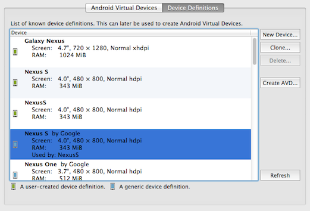
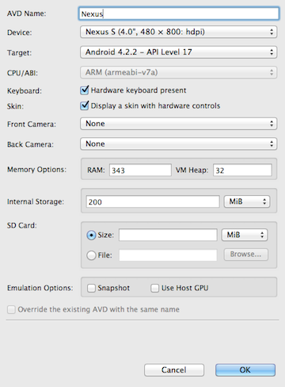
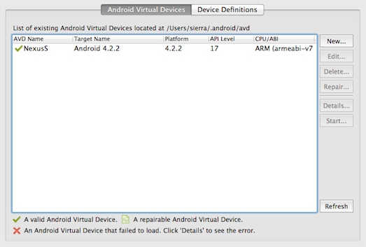
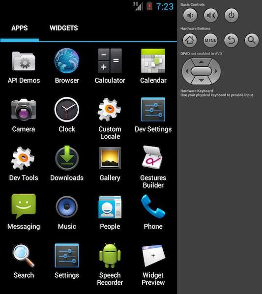
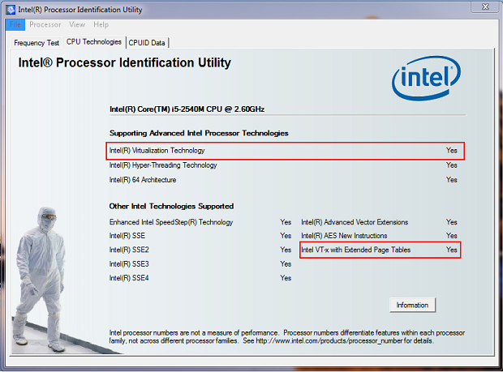
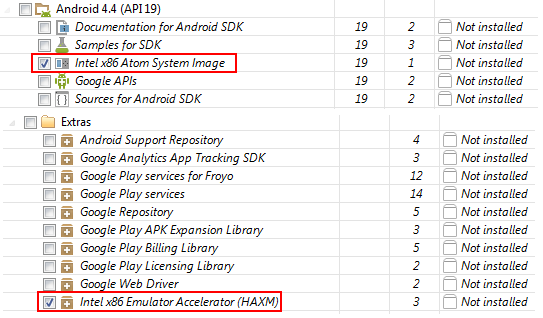
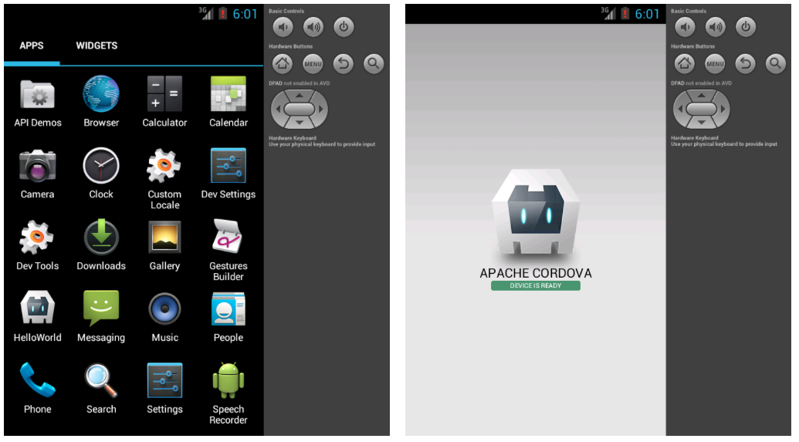

Android
====

本文将介绍了如何设置 SDK 环境来部署 Cordova 应用到 Android 设备上，以及在你的开发流程中如何选择使用 Android 命令行工具。不管你是以平台为中心的工作流程还是跨平台（命令行界面）的工作流程都需要安装 Android SDK。

## 需求及支持

Cordova 开发 Android 需要 Android SDK，可以安装在 OS X, Linux 或 Windows 操作系统。详见 [Android SDK 系统需求](http://developer.android.com/sdk/index.html#Requirements).

Cordova 支持 Android 4.0.x（Android API 14 开始） 及更高版本。原则是，Cordova 不再支持 市场占有率少于 5% 的 Android 版本（可参见 [Goolge 看板](http://developer.android.com/about/dashboards/index.html)）。Android  版本早于 Android API 10 及 3.x 版本占有率少于 5%。

## 安装 Java Development Kit (JDK)

安装 [JDK 7](http://www.oracle.com/technetwork/java/javase/downloads/jdk7-downloads-1880260.html) 或更高版本。

Windows 系统，需设置 `JAVA_HOME`值为 JDK 的安装路径。如， `C:\Program Files\Java\jdk1.7.0_75`）

## 安装 Android SDK

安装 [Android Stand-alone SDK Tools](http://developer.android.com/sdk/installing/index.html?pkg=tools) 或 [Android Studio](http://developer.android.com/sdk/installing/index.html?pkg=studio)。
若需要开发新的 Cordova 的 Android 插件，或者使用原生工具来运行或者调试 Android 平台，那么选择 Android Studio。否则 Android Stand-alone SDK Tools 足够用了。

需要将  SDK 的`tools` 和 `platform-tools`目录放到你的 `PATH`中。

* Mac 或 Linux ：修改 `~/.bash_profile`文件，添加 SDK安装信息，如下：`export PATH=${PATH}:/Development/android-sdk/platform-tools:/Development/android-sdk/tools`
* Windows : 修改环境变量 `PATH`，添加 SDK安装信息，如下：`;C:\Development\android-sdk\platform-tools;C:\Development\android-sdk\tools`

## 安装 SDK 包

打开 Android SDK Manager (例如，通过终端: `android`) 安装如下内容：

* Android 5.1.1 (API 22) platform SDK
* Android SDK Build-tools version 19.1.0 or higher
* Android Support Repository (Extras)

细节可以参考<http://developer.android.com/sdk/installing/adding-packages.html>

## 配置模拟器

Android sdk 没有提供默认的模拟器，需要自己配置。命令行运行`android`,点击`Tools → Manage AVDs` 选择`Device Definitions`  



点击 Create AVD ，选择修改名称，点击 OK 



此时，AVD 将出现在 Android Virtual Devices 列表中：



打开模拟器，选择 AVD 并点击 Start。



使用`Virtual Machine Acceleration`可以加速虚拟机，获得更好的体验。先确认你的系统是否支持如下该技术：

* Intel Virtualization Technology (VT-x, vmx) → [Intel VT-x 支持处理器的列表](http://ark.intel.com/products/virtualizationtechnology)
* AMD Virtualization (AMD-V, SVM), 支持 Linux (自 2006 年5月, 所有 CPU  AMD 包含 AMD-V, 除了 Sempron)

Windows 环境下，另外一个查找 Intel 处理器支持 VT-x 技术，是通过执行 `Intel Processor Identification Utility` ，你可以在 <https://downloadcenter.intel.com/Detail_Desc.aspx?ProductID=1881&DwnldID=7838> 下载该工具。或者使用 `OS Independent`,在 <https://downloadcenter.intel.com/Detail_Desc.aspx?ProductID=1881&DwnldID=7840&lang=eng> 下载该工具。

执行 `Intel Processor Identification Utility`，可看到如下界面：



为加速模拟器，下载至少一个 `Intel x86 Atom System Image`，如 
`Intel Hardware Accelerated Execution Manager (HAXM)`

打开 Android SDK Manager，选择如下：



下载后，可以执行  Android SDK 中的 `extras/intel/Hardware_Accelerated_Execution_Manager` 的 Intel 安装包，安装过程，遇到问题，可以查阅 <http://software.intel.com/en-us/android/articles/speeding-up-the-android-emulator-on-intel-architecture>

步骤如下：

1. 安装至少一个`Intel x86 Atom System Image`,如 `Intel Hardware Accelerated Execution Manager`
2. 运行 `Intel` 安装包，在 Android SDK 的`extras/intel/Hardware_Accelerated_Execution_Manager`
3. 创建新的 AVD 目标设为这个 Intel image
4. 当启动模拟器, 确保加载 HAX 模块时没有错误

## 创建项目

创建项目可以是选择 CLI 或者是 Android 特有的 shell 工具。使用 CLI 如下：

```
$ cordova create hello com.example.hello HelloWorld
$ cd hello
$ cordova platform add android
$ ccordova prepare              # or "cordova build"
```

Unix 、Windows 环境下，使用低级别的 shell 工具:

```
$ /path/to/cordova-android/bin/create /path/to/new/hello com.example.hello HelloWorld
C:\path\to\cordova-android\bin\create.bat C:\path\to\new\hello com.example.hello HelloWorld
```

## 构建项目

若使用 CLI，则项目的顶级 `www` 目录包含的就是源文件。构建执行如下：

```
$ cordova build                   # build all platforms that were added
$ cordova build android           # build debug for only Android
$ cordova build android --debug   # build debug for only Android
$ cordova build android --release # build release for only Android
```

若使用  Android 特有的 shell 工具，则有些不同。生成项目，默认的应用源码是在 `assets/www` 子目录。执行`build`将会清空项目文件，从新构建。以下是 Mac 和 Windows 下的语法，分别用于 debug 和 release

```
$ /path/to/project/cordova/build --debug
C:\path\to\project\cordova\build.bat --debug

$ /path/to/project/cordova/build --release
C:\path\to\project\cordova\build.bat --release
```

## 部署应用

使用 CLI ，部署应用到模拟器或者设备

```
$ cordova emulate android       #to deploy the app on a default android emulator
$ cordova run android --device  #to deploy the app on a connected device
```

否则，使用备用 shell 界面：

```
$ /path/to/project/cordova/run --emulator
$ /path/to/project/cordova/run --device
```

可以使用 `cordova run android --list` 查看所有存在的目标，  `cordova run android --target=target_name` 来运行特定的模拟器或者是设备(如`cordova run android --target="Nexus4_emulator"`)

使用`cordova run --help` 来查看其他的构建和运行选项。

启动应用，界面如下：



执行 `run` 它默认就 `build`了项目，其他附加参数有 `--debug`, `--release`, 和 `--nobuild`，来控制是否需要重新构建

```
$ /path/to/project/cordova/run --emulator --nobuild
```

## 其他命令

生成日志：

```
$ /path/to/project/cordova/log
C:\path\to\project\cordova\log.bat
```

清除项目:

```
$ /path/to/project/cordova/clean
C:\path\to\project\cordova\clean.bat
```
## 在 SDK 中打开新项目

当项目中已经添加了 android 平台，则可以用  Android Studio 打开：

1. 启动  Android Studio
2. 选择  Import Project (Eclipse ADT, Gradle, etc)


 和 [Building and Running from Android Studio](http://developer.android.com/tools/building/building-studio.html) 